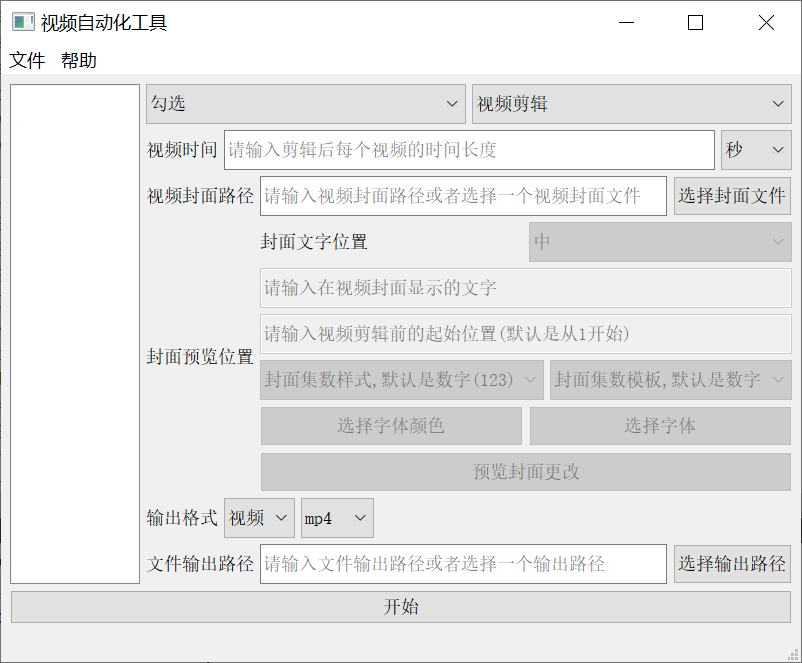
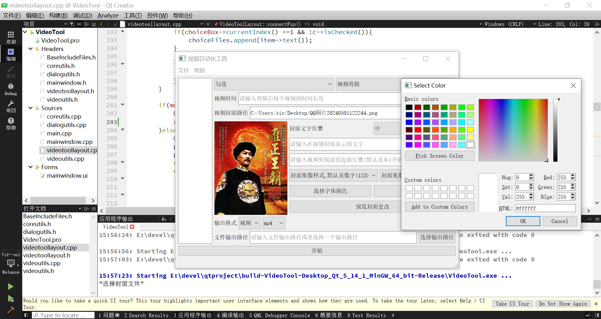

 - 视频自动化工具

测试环境：

	QT Creator 4.11.0
	
	QT Version 5.14.0
	
	Build Tool MinGw730_64
	
	System : Windows 10 18363 专业版
	
	内存大小 16G  双8G
	
	存储硬盘 某杂牌机械 5400转
	
	
	
	

该软件的界面、功能是由qt5+ffmpeg7.0实现.

FFmpeg部分除了本身命令文件外，还用到了avcodec、avformat、avdevice、avutil、avfilter库的内容，主要是用来实现获取视频时间、宽度、高度、视频裁剪(MP4)、音视频分离(MP4)这些功能.

QT5部分主要用到了多线程、文件IO、菜单栏、消息弹窗、进度弹窗、列表组件、下拉选择组件、文本跟数值编辑框组件.

该软件主要是用来编辑音视频的,支持批量自动化剪辑、提取音视频、转码等功能.

在剪辑视频的时候，支持自定义视频封面、输出的视频格式、插入封面文字、封面文字位置.

提取音频文件的时候,支持选择输出的音频格式.

转码音视频文件的时候，支持选择输出的音视频格式.

更新日期:2024年5月5日15点48分

软件界面一览：

